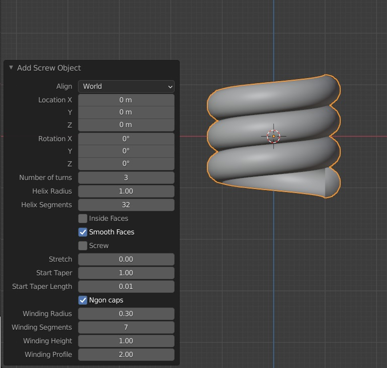

screwy.py
=========

Another helical mesh add-on for Blender.
For making springs and screws.
Economical on geometry using semi-circle profile with super-ellipse tweaking.




Don't hesitate to add issues or open a conversation about design decisions.

# Usage in scripts

```python
add_screwy()
# or
add_screwy(
    helix_segments=32,
    helix_radius=1,
    stretch=0,
    taper_turns=1,
    min_taper=0.01,
    join_windings=False,
    winding_segments=7,
    winding_radius=0.3,
    winding_height=1,
    winding_profile=2)
```

Caution
-------

- Check normals if setting height to negative

License
=======
GPL3

